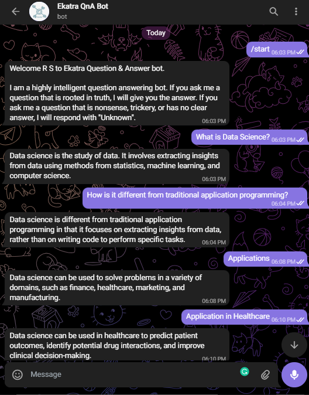

<h1 align="center">Welcome to Ekatra QnA Telegram Bot! 👋</h1>
<p>
  
  <a href="#" target="_blank">
    
    <a href="https://www.npmjs.com/package/openai" target="_blank">
  </a>
  <a href="#" target="_blank">
    
  </a>
  </a>
  </a>
</p>

> A Node.js-based Telegram bot powered by OpenAI that provides simple and inventive answers to your questions.

## Demo
> Username: [@Ektra_OpenAI_Bot](https://t.me/Ektra_OpenAI_Bot)
>
> Link: https://t.me/Ektra_OpenAI_Bot


---
## Tech Stack
1. [**node-telegram-bot-api**](https://github.com/yagop/node-telegram-bot-api) : It is Node.js module to interact with the official Telegram Bot API.

2. [**Airtable**](https://support.airtable.com/hc/en-us) :  Airtable is an easy-to-use online platform for creating and sharing relational databases.
It is a spreadsheet-database hybrid which lets you create powerful databases that can be used to power custom applications.
Airtable has two APIs:
    * [REST API](https://support.airtable.com/hc/en-us/sections/360009623014-API)
    * [Metadata API](https://airtable.com/api/meta)
    

3. [**Railway**](https://railway.app/) : Railway is a platform for deployment where you can set up infrastructure, work with it locally, and then deploy to the cloud.

4. [**OpenAI GPT-3**](https://beta.openai.com/examples) : GPT-3, created by OpenAI, is a machine learning model specialising on language processing. GPT-3 generates new text from an input text. Depending on the input and the precise flavour of GPT-3 applied, the output text will conform to a job like as responding to a question stated in the input or finishing the input with additional information.
---
## Obtain API keys:

### A. _Creating new bot with BotFather_
1. Send [@BotFather](https://t.me/botfather) a `/newbot` message
2.	Pick name and username.
3.	Receive a BOT_TOKEN

B. *Airtable REST API*
1. Create an account on Airtable.
2. Go to your [account page](https://airtable.com/account)
3. Under API heading in Account Overview page, click **Generate API key button**.

C. *OpenAI*
1. Create an account on [OpenAI](https://beta.openai.com/signup/)
2. Go to your [account page](https://beta.openai.com/account)
3. Under User heading, go to API keys and click **Create new secret Key** 
---
## Test the bot locally
After getting all the API keys. Follow these steps:

1. Git clone or download this repository
  ```sh
  git clone https://github.com/vruksheco/Ekatra-QnA-Bot.git 

  cd Ekatra-QnA-Bot
  ```
2. Install all dependencies
```sh
npm install
```
3. Rename .env_example file into .env and set 
 <ol type="i">
      <li> <i>TOKEN</i> to your telegram bot API key</li>
      <li> <i> apiKey</i> to your OpenAI key</li>
      <li> <i>airtable_api</i> to your Airtable REST API key.</li>
  </ol>

4. Set up and connect MongoDB environment of your choice
4. Run 

```sh
npm start
```
---
## Deploy the bot on Railway

1. Create a github repository for the bot.
2. Sign up or login to your [railway.app](https://railway.app/) account
3. Create a new project and select *Deploy from GitHub repo* > *Configure Github app* and link your bot github repository.
4. Once the project starts deploying, go to *variables* and add the environment variables.
5. Create a new service and select *Provision Mongo db*

---
## Congrats! 🤖🎉

The bot is up and running. 
(If not - check Railway Deploy logs)

Follow [Telegram Bot API](https://core.telegram.org/bots/api) for latest updates.

Share your bot on [Store Bot](https://storebot.me/)

Reference:
1. [GPT-3 Chatbot with Python by John Mannelly](https://jman4190.medium.com/how-to-build-a-gpt-3-chatbot-with-python-7b83e55805e6)
---
## Contributions
If you have any suggestion on how to improve the code create a [PR request](https://github.com/vruksheco/Ekatra-QnA-Bot/pulls) or faced any issues feel free to [contact me](https://github.com/vruksheco/Ekatra-QnA-Bot/issues).


---

## Author

👤 **Ramsha Shaikh**

* Github: [@ramshashaikh](https://github.com/ramshashaikh)
----

## Show your support

Give a ⭐️ if this project helped you!

***